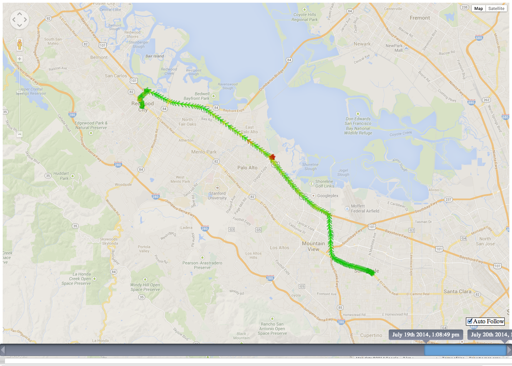
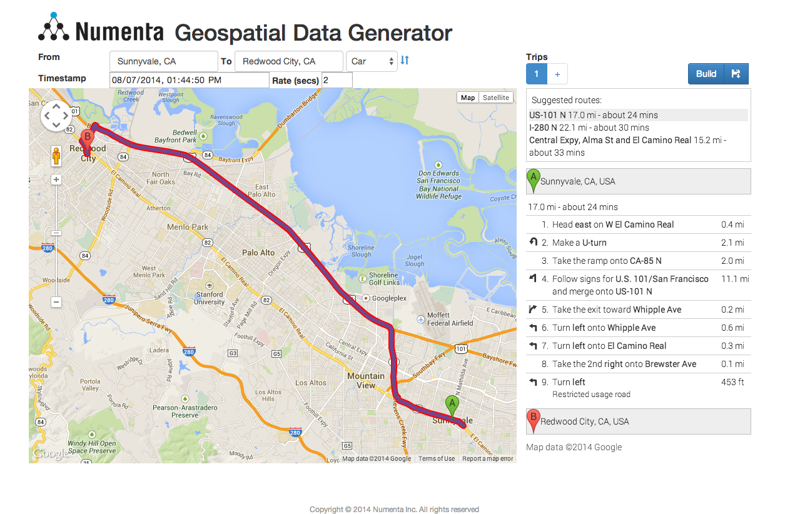

# NuPIC Geospatial Tracking Application

 

Geospatial anomaly detection app using NuPIC.

## Dependencies

You must have [NuPIC](https://github.com/numenta/nupic) installed. Please follow the installation instructions there.

Now, install the other python requirements for `nupic.geospatial`:

    pip install -r requirements.txt

## Usage

To run, simply start the web server from the command line:

    python server.py

This will start a web server and load some initial sample data for viewing. Open `http://localhost:5000` in your browser to view and walk through the tracks.

### Loading Your Own GPS Tracks

You can create GPS tracks with many mobile applications and GPS trackers. Any GPS data in the [GPX](http://www.topografix.com/gpx.asp) file format can be loaded into `nupic.geospatial` (which runs it through NuPIC) and analyzed through the web browser. Here are a couple of popular apps you might use on your phone that produce GPX files:

- [GPSKit](http://gpskit.garafa.com/GPSKit/GPS_Kit_for_iPhone_%26_iPad.html) (iPhone / iPad)
- [GPS Logger](https://play.google.com/store/apps/details?id=com.mendhak.gpslogger&hl=en) (Android)

#### Converting [GPX](http://www.topografix.com/gpx.asp) Files

You can convert one file or a directory full of GPX files into a format that is readable by `nupic.geospatial`. To do this, run the script as shown below:

    ./tools/convert_gpx.py <path/to/gpx/file/or/folder>

This will write out a file you can use as input for `./run.py` (described below). For all options, run `./tools/convert_gpx.py --help`

#### Running Converted Tracks Through `nupic.geospatial`

Now that you have converted your GPX files into the proper format for `nupic.geospatial`, there is another script to run them through NuPIC.

    ./run.py <path/to/input/csv>

The input file could be converted GPX data (see above) or the results from the route simulator in the web app (see below). This script will automatically create sequences base on the timing of the input rows. If you don't want this behavior, you can negate it with the `--manual-sequence` option, which will create sequences based upon the `name` field of the input CSV file. There are several other options available for this command. Run `./run.py --help` to see them all.

After running this script, the output data will be written `static/js/data.js`, where the web server can load it into the browser. Now you can simply run `python server.py` to start the server and view your analyzed data.

### Using the route simulator

You can experiment with different routes without a GPS device by using the route simulator. It will generate geospatial data and run it through NuPIC while the server is running. Simply open `http://localhost:5000/simulate` in your browser. Once you've created a route (or routes), you can either run them immediately through NuPIC with the "Build" button (at the top right of the screen), or you can save the tracks to a local file for running later with the `run.py` script (see above).

